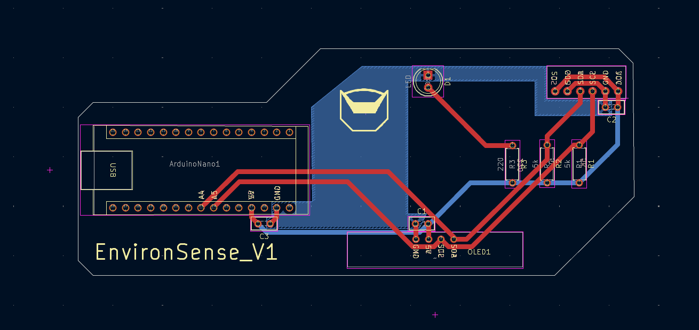

# EnvironSense - Embedded Environmental Monitoring System
EnvironSense is a compact Arduino-based environmental monitoring system that measures temperature, humidity, pressure, and air quality using a BME680 sensor and displays real-time data on a 128×64 monochrome OLED display.

The system is built around an Arduino Nano and uses I²C communication to interface with both the BME680 sensor and the OLED display. Environmental data is presented through a lightweight, text-based embedded UI designed to operate within limited SRAM and processing constraints.

<u>Features</u>

- Real-time display of temperature (°C/°F), relative humidity, air pressure, and an air quality proxy based on gas resistance

- I²C-based sensor and display communication

- Low-memory OLED interface using the U8x8 text-only graphics library

- Flicker-free UI updates with clear status indicators

- Interpretation of raw sensor data into qualitative environmental states (e.g., humidity and air quality levels)

<u>Design Focus</u>

This project emphasizes practical embedded systems concepts, including sensor integration, efficient memory usage, and firmware design under hardware constraints. Particular attention was given to balancing system simplicity with usability, resulting in a compact design that remains readable, responsive, and reliable.

## Hardware Design

